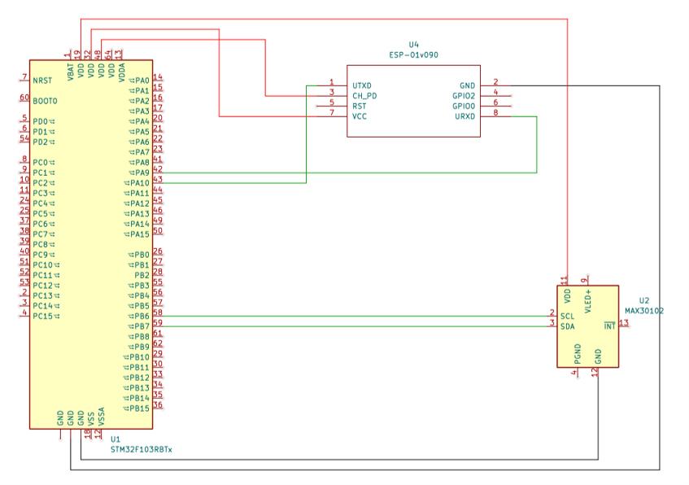
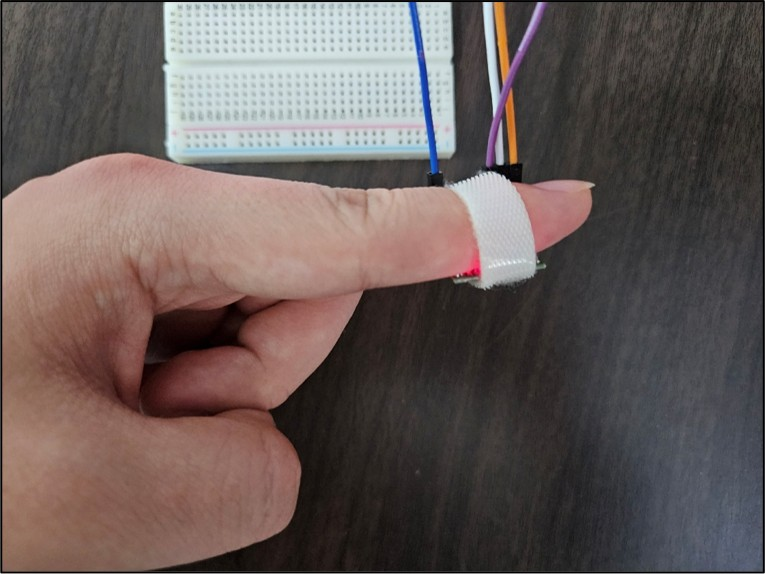
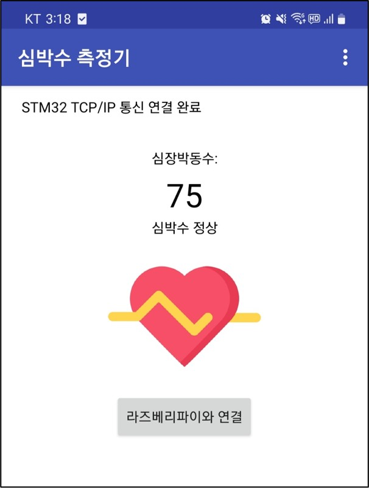

  

# Embedded Developer
    
## 👋 소개
안녕하세요. 저는 **MINSCHOI**입니다.  
임베디드 시스템과 IoT 개발에 열정을 가진 신입 개발자입니다.  
STM32, Raspberry Pi, Arduino 등 다양한 하드웨어 플랫폼에서  
센서 제어, 통신, 데이터 처리 등 **하드웨어-소프트웨어 통합 개발 경험**을 보유하고 있습니다.  
사용자의 편의성과 시스템 효율성 향상을 목표로 프로젝트를 수행하고 있습니다.

- 🔧 **기술 스택**:
  - **프로그래밍 언어:** C / C++ / Python
  - **MCU 제어 / 펌웨어:** STM32, Arduino
  - **마이크로프로세서 / 싱글보드 컴퓨터:** Raspberry Pi (Linux 기반)
  - **통신 프로토콜:** I2C, SPI, UART, TCP/IP, Wi-Fi, Bluetooth
  - **기능 개발:** 센서 데이터 처리 및 IoT 시스템 구축

- 📫 **연락처**:
  - 이메일: **chlalstlr561@daum.net**  
    
## 🚀 주요 프로젝트

### 1. 스마트 헬스 밴드
이 프로젝트는 사용자의 심박수를 측정하고, 스마트폰 앱을 통해 실시간으로 확인할 수 있는 웨어러블 IoT 기기입니다.
ESP8266 Wi-Fi 모듈을 이용해 스마트폰과 TCP/IP 통신으로 데이터를 송수신하며, MAX30102 센서를 통해 정확한 심박수 데이터를 측정합니다.

- MAX30102 센서를 이용해 사용자의 심박수를 정밀 측정
- ESP8266 Wi-Fi 모듈을 통해 TCP/IP 기반 실시간 데이터 송수신
- 스마트폰 앱에서 실시간 심박수 모니터링 가능
- STM32 MCU 기반으로 센서 제어 및 데이터 전송 로직 구현

⚙️ 시스템 구성
- MCU: STM32
- 센서: MAX30102 (심박수 센서)
- 통신 모듈: ESP8266 (Wi-Fi)
- 통신 방식: TCP/IP

### 📸 프로젝트 사진

  
   
  스마트 헬스 밴드의 회로도

  

  
  
   
  MAX30102 센서를 통해 심박수 측정 후, 앱을 통해 스마트폰으로 데이터 수신 및 시각화

### 2. 통신을 활용한 조도 기반 조명 제어 시스템
이 프로젝트는 주변 조도를 측정하여 자동으로 조명을 제어하는 스마트 조명 시스템입니다.
밝기 센서를 통해 실시간으로 환경을 감지하고, 조도 값에 따라 조명을 자동 ON/OFF 하여 사용자의 편의성과 에너지 효율을 높입니다.

- BH1750 조도 센서를 I2C 통신으로 제어하여 주변 밝기 값을 측정
- MAX7219 도트 매트릭스를 SPI 통신으로 제어하여 조도 상태를 시각적으로 표시
- STM32 MCU 기반으로 조명 제어 로직 구현
- 어두운 환경에서는 자동 점등, 밝은 환경에서는 자동 소등 기능 제공

⚙️ 시스템 구성
- MCU: STM32
- 센서: BH1750 (조도 센서)
- 표시 장치: MAX7219 (도트 매트릭스)

### 3. 비정상 환경 감지를 위한 온·습도 모니터링 시스템
이 시스템은 고온(35℃ 이상) 또는 고습(60% 이상) 환경에서 발생할 수 있는 위험 요소를 사전에 감지하기 위해 개발된 실시간 온·습도 모니터링 시스템입니다.
DHT22 센서와 Raspberry Pi를 기반으로 동작하며, Wi-Fi TCP 통신을 통해 원격에서도 실시간으로 데이터를 확인할 수 있습니다.

- DHT22 센서로 온도와 습도를 실시간 측정
- Raspberry Pi가 데이터 수집 및 TCP 서버 역할 수행
- Wi-Fi를 통한 무선 통신으로 PC, 스마트폰 등 클라이언트에서 실시간 데이터 모니터링
- 온도 35℃ 이상 / 습도 60% 이상 시 경고 메시지 전송

⚙️ 시스템 구성
- 센서: DHT22 (온도·습도 측정)
- MCU/플랫폼: Raspberry Pi
- 통신 방식: TCP/IP (Wi-Fi 기반)
- 클라이언트: 스마트폰 

### 4. **장애인을 위한 음성인식 키오스크**
이 프로젝트는 장애인이 쉽게 접근할 수 있도록 음성인식 기능이 포함된 키오스크 시스템입니다. 터치 및 음성으로 키오스크를 조작할 수 있도록 설계되었습니다.

- Google Speech API를 통한 음성인식 시스템 구현
- GUI(그래픽 사용자 인터페이스)로 메뉴 탐색 및 선택 가능
- 선택한 메뉴나 입력한 명령에 대한 시각적 및 음성 피드백 제공

⚙️ 시스템 구성

- 플랫폼: Raspberry Pi
- 언어: Python
- 음성인식 API: Google Speech-to-Text
- 입출력 장치: 마이크, 스피커, 터치 디스플레이

#### 🎥 비디오 보기

### 5. **VoiceHub Mirror**
VoiceHub Mirror는 음성인식 기반의 스마트 미러로, 사용자의 음성 명령을 통해 IoT시스템을 제공하는 시스템입니다.

- Raspberry Pi의 GPIO핀을 사용하여 Servo 모터, 카메라, 스피커, LED를 제어
- Speech Recognition으로 음성을 텍스트로 변환하여 명령을 인식
- 음성 명령으로 다양한 센서를 제어하여 스마트 홈 환경 조성
- OpenCV를 통해 카메라를 제어하고 실시간 비디오 피드를 제공

⚙️ 시스템 구성

- 플랫폼: Raspberry Pi
- 언어: Python
- 음성인식 모듈: SpeechRecognition, Google Speech API
- 하드웨어: Servo 모터, 카메라, LED, 스피커

#### 🎥 비디오 보기

### 6. **블루투스를 활용한 격투 로봇**
블루투스 통신을 활용하여 원격으로 조종 가능한 격투 로봇 프로젝트입니다. 로봇 간의 싸움 및 동작 제어를 arduino를 통해 직접 할 수 있습니다.

- Arduino의 GPIO핀을 사용하여 DC Motor, 충격 센서, LED를 제어
- 블루투스 모듈의 마스터-슬레이브 구조를 통해 로봇과 컨트롤러 간의 데이터 전송
- 로봇 간의 물리적 충돌 및 격투 동작을 위한 충격 센서 및 DC 모터로 동작 구현

⚙️ 시스템 구성

- MCU: Arduino Uno
- 센서: 충격 센서
- 구동 장치: DC 모터, LED
- 통신 모듈: HC-06 Bluetooth
- 통신 방식: UART

#### 🎥 비디오 보기

## 🛠 사용 도구 및 기술

- **IDE**: Visual Studio, Visual Studio Code, STM32Cube
- **버전 관리**: Git
- **하드웨어 플랫폼**: STM32, Raspberry Pi, Arduino
